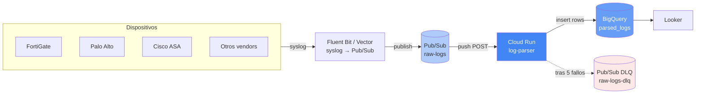

# Pipeline de logs de seguridad → BigQuery

Parser multi-vendor para logs de firewalls, WAF e IPS. Recibe syslog de
distintas cajas (Fortinet, Palo Alto, Check Point, Cisco ASA, WatchGuard,
ModSecurity, iptables, etc.), normaliza los campos a un esquema canónico
y los almacena en BigQuery para análisis y visualización en Looker.

---

## Arquitectura

```
                        ┌──────────────────────────────┐
                        │    DISPOSITIVOS DE RED       │
                        │  Fortinet · Palo Alto · ASA  │
                        │  WatchGuard · CheckPoint     │
                        │  ModSecurity · iptables ...  │
                        └──────────────┬───────────────┘
                                       │ syslog UDP/TCP
                                       ▼
                        ┌──────────────────────────────┐
                        │      COLECTOR SYSLOG         │
                        │   (Fluent Bit / Vector)      │
                        │      [siguiente fase]        │
                        └──────────────┬───────────────┘
                                       │ publish
                                       ▼
                        ┌──────────────────────────────┐
                        │      PUB/SUB · raw-logs      │
                        │   (buffer + retry + DLQ)     │
                        └──────────────┬───────────────┘
                                       │ push (POST autenticado)
                                       ▼
                ┌──────────────────────────────────────────┐
                │           CLOUD RUN · log-parser         │
                │  ┌────────────────────────────────────┐  │
                │  │  1. Decode base64 del Pub/Sub      │  │
                │  │  2. Detectar vendor (matchers)     │  │
                │  │  3. Extraer campos a schema común  │  │
                │  │  4. Insert en BigQuery             │  │
                │  └────────────────────────────────────┘  │
                └────────────┬─────────────────────────────┘
                             │
                             ▼
                ┌──────────────────────────────┐         ┌──────────────┐
                │     BIGQUERY · parsed_logs   │────────▶│    LOOKER    │
                │  Particionado por día        │         │  Dashboards  │
                │  Clusterizado vendor+src_ip  │         └──────────────┘
                └──────────────────────────────┘

                        Mensajes que fallan 5 veces ──▶ Pub/Sub DLQ
```

### Diagrama de flujo (renderizado en GitHub)



---

## Estructura del proyecto

```
parser/
├── README.md              ← este archivo
├── Dockerfile             ← imagen para Cloud Run
├── requirements.txt       ← dependencias Python
├── deploy.sh              ← despliegue idempotente en GCP
├── teardown.sh            ← limpieza (borra todo)
├── main.py                ← entrypoint Flask: recibe Pub/Sub push
├── bq_writer.py           ← cliente BigQuery con retry
├── parsers/
│   ├── __init__.py        ← registry: importa todos los parsers
│   ├── base.py            ← clase BaseParser + ParsedLog (esquema canónico)
│   ├── _helpers.py        ← parse_kv, parse_leef_header, parse_cef_header
│   ├── fortinet.py        ← Fortinet FortiGate (key=value)
│   ├── paloalto.py        ← Palo Alto Networks (LEEF)
│   ├── modsecurity.py     ← ModSecurity / nginx (formato bracket)
│   ├── generic_cef.py     ← fallback CEF (CheckPoint, F5, ArcSight)
│   └── _others.py         ← WatchGuard, Cisco ASA, Juniper SRX,
│                            SonicWall, iptables, CheckPoint key:value
└── tests/
    └── test_parsers.py    ← pruebas locales sin GCP
```

---

## Vendors soportados

| # | Vendor | Producto | Detección | Formato |
|---|--------|----------|-----------|---------|
| 1 | Fortinet | FortiGate | `devname=FGT...` | key=value |
| 2 | Palo Alto Networks | PAN-OS | `LEEF: ... Palo Alto` | LEEF |
| 3 | WatchGuard | Firebox | `LEEF: ... WatchGuard` | LEEF |
| 4 | Check Point | VPN-1/Smart-1 | `CEF: ... Check Point` | CEF |
| 5 | Cisco | ASA / Firepower | `%ASA-X-XXXXXX` | propietario |
| 6 | Juniper | SRX | `RT_FLOW` o `source-address=` | structured-data |
| 7 | SonicWall | NSA / TZ | `id=firewall sn=...` | key=value |
| 8 | Linux | iptables / Netfilter | `SRC=...DST=...PROTO=` | mayúsculas |
| 9 | Trustwave / OWASP | ModSecurity | `modsec` o `OWASP_CRS` | bracket tags |
| 10 | * | Cualquier CEF estándar | `CEF: ...` | CEF (fallback) |

Logs no reconocidos quedan registrados con `vendor='unknown'` (se almacena el log
crudo para análisis posterior — nunca se pierde un mensaje).

---

## Esquema de BigQuery

La tabla `parsed_logs` se crea con este schema:

| Columna | Tipo | Descripción |
|---|---|---|
| `ingest_timestamp` | TIMESTAMP | Cuándo se procesó (campo de partición) |
| `vendor` | STRING | Identificador del fabricante (clustering) |
| `product` | STRING | Producto específico |
| `raw_log` | STRING | Log original sin modificar |
| `event_timestamp` | TIMESTAMP | Cuándo ocurrió el evento (según el log) |
| `source_ip` | STRING | IP origen (clustering) |
| `source_port` | INTEGER | Puerto origen |
| `dest_ip` | STRING | IP destino |
| `dest_port` | INTEGER | Puerto destino |
| `protocol` | STRING | tcp / udp / icmp / ... |
| `action` | STRING | allow / deny / block / drop |
| `rule_name` | STRING | Política o regla aplicada |
| `user` | STRING | Usuario autenticado (si aplica) |
| `bytes_sent` | INTEGER | Bytes enviados |
| `bytes_received` | INTEGER | Bytes recibidos |
| `hostname` | STRING | Hostname del dispositivo o destino |
| `severity` | STRING | Severidad/prioridad |
| `message` | STRING | Mensaje legible |
| `extra` | JSON | Campos específicos del vendor |

**Optimizaciones:**
- Particionado diario por `ingest_timestamp` → queries con filtro de fecha
  leen solo las particiones relevantes (10-100× más barato)
- Clustering por `vendor, source_ip` → filtros típicos como
  "actividad de Fortinet" o "todo lo de IP X" son ultra rápidos

---

## Despliegue rápido

```bash
# 1. Editar variables al inicio de deploy.sh (PROJECT_ID, REGION)
vim deploy.sh

# 2. Ejecutar (toma 3-5 min)
./deploy.sh

# 3. Probar con un log de ejemplo
gcloud pubsub topics publish raw-logs --message='date=2026-04-01 time=14:22:10 devname="FGT" srcip=192.168.10.25 dstip=203.0.113.10 action="blocked"'

# 4. Verificar en BigQuery
bq query --use_legacy_sql=false "
SELECT vendor, source_ip, dest_ip, action
FROM \`PROJECT_ID.network_logs.parsed_logs\`
WHERE DATE(ingest_timestamp) = CURRENT_DATE()
ORDER BY ingest_timestamp DESC LIMIT 10"
```

Ver `deploy.sh` para los detalles completos. El script es idempotente: lo
puedes correr varias veces sin problemas.

### Limpieza

```bash
./teardown.sh   # borra TODO (con confirmación)
```

---

## Cómo agregar un vendor nuevo

Crear un archivo en `parsers/` siguiendo este patrón:

```python
# parsers/sophos.py
from .base import BaseParser, ParsedLog, register
from ._helpers import parse_kv, safe_int, now_utc

@register
class SophosParser(BaseParser):
    vendor = "sophos"
    product = "xg"
    priority = 55  # menor = se evalúa antes

    def matches(self, raw_log: str) -> bool:
        return "device='SFW'" in raw_log

    def parse(self, raw_log: str) -> ParsedLog:
        kv = parse_kv(raw_log)
        return ParsedLog(
            ingest_timestamp=now_utc(),
            vendor=self.vendor,
            product=self.product,
            raw_log=raw_log,
            source_ip=kv.get("src_ip"),
            source_port=safe_int(kv.get("src_port")),
            dest_ip=kv.get("dst_ip"),
            dest_port=safe_int(kv.get("dst_port")),
            protocol=kv.get("protocol"),
            action=kv.get("status"),
        )
```

Luego agregarlo a `parsers/__init__.py`:

```python
from . import sophos       # noqa: F401
```

El registry recoge el nuevo parser automáticamente. No hay que tocar nada más.

---

## Pruebas locales

```bash
cd parser/
python tests/test_parsers.py
```

Salida esperada:

```
================================================================================
VENDOR          | PRODUCT         | SOURCE_IP          | DEST_IP            | ACTION
================================================================================
✓ fortinet      | fortigate       | 192.168.10.25      | 203.0.113.10       | blocked
✓ paloalto      | pan-os          | 10.10.20.5         | 1.1.1.1            | TRAFFIC
✓ modsecurity   | modsecurity     | 198.51.100.100     | None               | warning
✓ watchguard    | firebox         | 192.168.1.222      | 34.228.135.247     | Allow
✓ linux         | iptables        | 203.0.113.50       | 10.0.0.5           | deny
✓ cisco         | asa             | 203.0.113.10       | 192.168.1.50       | allow
✓ check_point   | vpn-1_&_firewall-1 | 192.168.101.100 | 52.173.84.157      | Accept
================================================================================
Resultado: ✓ TODO OK
```

---

## Operación

### Ver logs del parser

```bash
gcloud run logs read log-parser --region us-central1 --limit 50
```

### Inspeccionar mensajes en el DLQ

Mensajes que fallaron 5 veces seguidas terminan en `raw-logs-dlq`. Para verlos:

```bash
# Solo la primera vez: crear suscripción al DLQ
gcloud pubsub subscriptions create raw-logs-dlq-inspector --topic raw-logs-dlq

# Leer mensajes pendientes
gcloud pubsub subscriptions pull raw-logs-dlq-inspector --auto-ack --limit 10
```

### Métricas útiles en BigQuery

```sql
-- Distribución por vendor en las últimas 24h
SELECT vendor, COUNT(*) as eventos
FROM `PROJECT_ID.network_logs.parsed_logs`
WHERE ingest_timestamp >= TIMESTAMP_SUB(CURRENT_TIMESTAMP(), INTERVAL 24 HOUR)
GROUP BY vendor
ORDER BY eventos DESC;

-- Top 10 IPs origen bloqueadas
SELECT source_ip, COUNT(*) as bloqueos
FROM `PROJECT_ID.network_logs.parsed_logs`
WHERE action IN ('deny', 'blocked', 'drop', 'block')
  AND DATE(ingest_timestamp) = CURRENT_DATE()
GROUP BY source_ip
ORDER BY bloqueos DESC
LIMIT 10;

-- Logs no reconocidos (oportunidades para nuevos parsers)
SELECT raw_log, COUNT(*) as occurrences
FROM `PROJECT_ID.network_logs.parsed_logs`
WHERE vendor = 'unknown'
  AND DATE(ingest_timestamp) >= DATE_SUB(CURRENT_DATE(), INTERVAL 7 DAY)
GROUP BY raw_log
ORDER BY occurrences DESC
LIMIT 20;
```

---

## Costos aproximados (PoC)

Para un volumen bajo (~1 GB/día, ~10 M eventos/mes):

| Servicio | Costo mensual estimado |
|---|---|
| Cloud Run (escala a cero) | $0 – $5 |
| Pub/Sub (primeros 10 GB gratis) | $0 |
| BigQuery storage (~30 GB) | $0.60 |
| BigQuery streaming inserts | $5 |
| **Total** | **~$10/mes** |

A escala media (50 GB/día) sube a ~$200/mes. A esa escala vale la pena migrar
de streaming inserts a **Storage Write API** (50% más barato) y considerar
**Dataflow** en vez de Cloud Run para el parseo.

---

## Próximos pasos

- [ ] **Receptor syslog** (Fluent Bit en Cloud Run) que tome de las cajas y publique a Pub/Sub
- [ ] **Vistas materializadas** en BigQuery para acelerar dashboards de Looker
- [ ] **Migración a Storage Write API** cuando el volumen pase de PoC
- [ ] **Enriquecimiento con GeoIP** (MaxMind) para mapas de origen
- [ ] **Detección de anomalías** con BigQuery ML
- [ ] **Modelo LookML** apuntando a la tabla parseada
